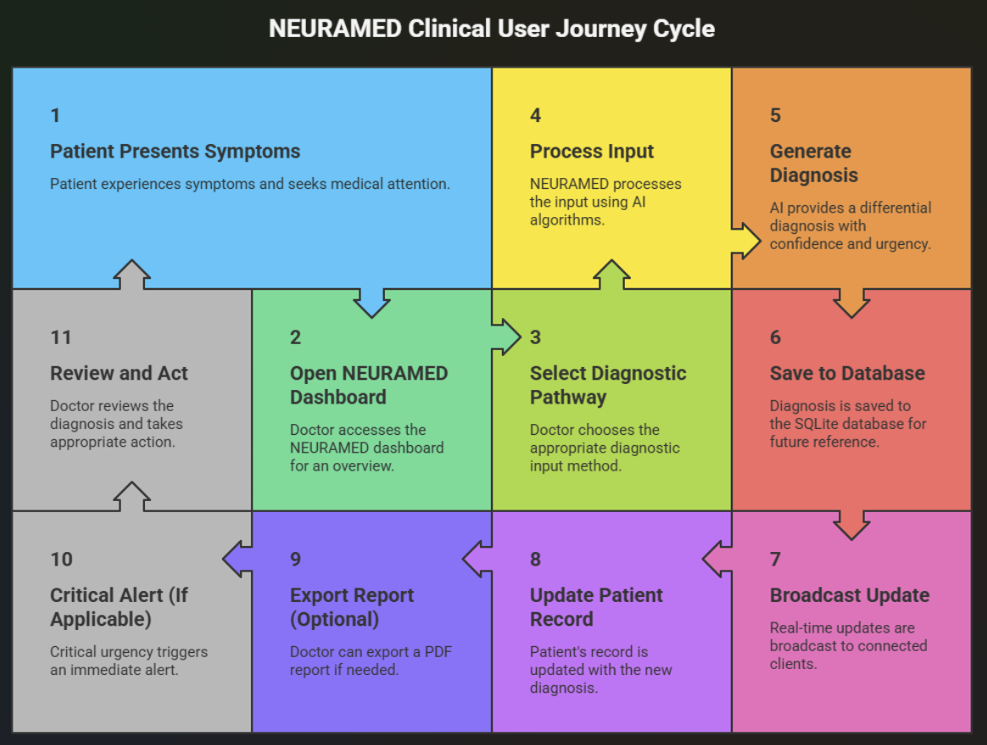
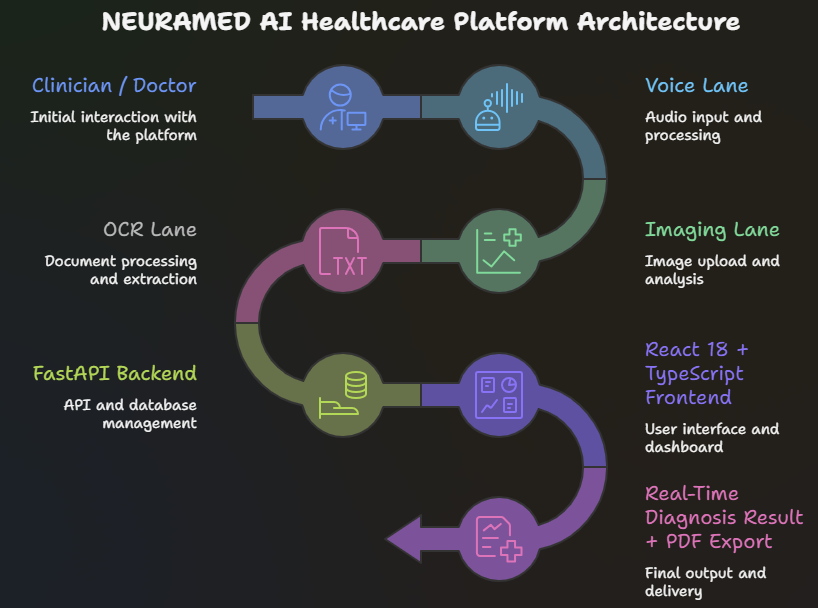

<div align="center">

<br />

```
███╗   ██╗███████╗██╗   ██╗██████╗  █████╗ ███╗   ███╗███████╗██████╗
████╗  ██║██╔════╝██║   ██║██╔══██╗██╔══██╗████╗ ████║██╔════╝██╔══██╗
██╔██╗ ██║█████╗  ██║   ██║██████╔╝███████║██╔████╔██║█████╗  ██║  ██║
██║╚██╗██║██╔══╝  ██║   ██║██╔══██╗██╔══██║██║╚██╔╝██║██╔══╝  ██║  ██║
██║ ╚████║███████╗╚██████╔╝██║  ██║██║  ██║██║ ╚═╝ ██║███████╗██████╔╝
╚═╝  ╚═══╝╚══════╝ ╚═════╝ ╚═╝  ╚═╝╚═╝  ╚═╝╚═╝     ╚═╝╚══════╝╚═════╝
```

### **Clinical AI Diagnostic Intelligence Platform**

*Voice · Imaging · OCR — Three agents. One diagnosis.*

<br />

[](https://fastapi.tiangolo.com)
[](https://react.dev)
[](https://typescriptlang.org)
[](https://python.org)
[](https://groq.com)
[](LICENSE)

<br />

[**Live Demo**](https://neuramed.vercel.app) · [**API Docs**](https://neuramed.railway.app/docs) · [**Report Bug**](../../issues) · [**Request Feature**](../../issues)

<br />

</div>

---

<div align="center">

### User Cycle Overview



<br /><br />

### Architecture



</div>

<br />

---

## What Is NEURAMED?

NEURAMED is a **full-stack AI diagnostic platform** that puts three specialized clinical intelligence agents — Voice Diagnosis, Medical Imaging AI, and OCR Report Reader — into a single, unified dashboard. Built for speed, accuracy, and clinical precision.

Every diagnosis is powered by **LLaMA 3 70B via Groq** (sub-second inference), persisted to a structured database, broadcast in real-time via WebSocket, and exportable as a clinical PDF — all from a dark, instrument-grade UI that looks like it belongs in an ICU.

This is not a prototype. This is a production-grade system.

<br />

---

## The Three Agents

<br />

### 🎤 Voice Diagnosis Agent
Accepts spoken or typed symptoms. Transcribes audio via **ElevenLabs Scribe**, processes the transcript through a medical-grade LLaMA 3 prompt, and returns a structured differential diagnosis with confidence scoring, urgency classification, and ranked treatment recommendations — in under 2 seconds.

```
Input:  "chest pain radiating to left arm, sweating, shortness of breath"
Output: Acute Coronary Syndrome (94%) · Aortic Dissection (61%) · GERD (23%)
        Urgency: CRITICAL  |  Confidence: 0.94  |  Processing: 1.2s
```

<br />

### 🧠 Medical Imaging AI Agent
Accepts CT scans, MRIs, X-Rays, and Ultrasound images. Runs a full **OpenCV pipeline** — CLAHE histogram equalization, Gaussian denoising, Otsu thresholding, contour analysis — to detect and annotate anomaly regions. LLaMA 3 then interprets the region statistics into clinical radiological findings. Returns the original scan side-by-side with a fully annotated version.

```
Input:  CT scan JPEG/PNG/DICOM
Output: Annotated image + bounding boxes + confidence per region
        + LLM radiological impression + follow-up recommendations
```

<br />

### 📄 OCR Report Reader Agent
Accepts PDF medical reports or scanned document images. **PyTesseract** extracts raw text, a regex-based section parser structures it into clinical sections (Chief Complaint, Findings, Impression, Plan), and LLaMA 3 generates a 3-sentence summary plus key findings, abnormal flags, and medication list.

```
Input:  Any medical report PDF or image
Output: Structured sections + AI summary + abnormal flags + medications
        + urgency classification + exportable findings
```

<br />

---


## Tech Stack

### Backend
| Layer | Technology | Purpose |
|-------|-----------|---------|
| API Framework | FastAPI 0.111 | REST endpoints + WebSocket |
| ORM | SQLAlchemy 2.0 | Database models + queries |
| Database | SQLite → PostgreSQL | Persistent storage |
| Validation | Pydantic v2 | Request/response schemas |
| LLM | Groq API (LLaMA 3 70B) | AI diagnosis + interpretation |
| Voice STT | ElevenLabs Scribe | Audio → text transcription |
| Imaging | OpenCV + scikit-image | Scan analysis + annotation |
| OCR | PyTesseract + pdf2image | Document text extraction |
| PDF Export | ReportLab | Clinical report generation |
| Real-time | WebSocket (built-in) | Live dashboard feed |
| Server | Uvicorn | ASGI production server |

### Frontend
| Layer | Technology | Purpose |
|-------|-----------|---------|
| Framework | React 18 + TypeScript | UI components |
| Build Tool | Vite 5 | Dev server + bundler |
| Styling | TailwindCSS + CSS Variables | Design system |
| Animation | Framer Motion | All transitions + reveals |
| Charts | Recharts | Data visualization |
| Data Fetching | TanStack Query v5 | Cache + real-time sync |
| HTTP Client | Axios | API communication |
| Routing | React Router v6 | Client-side navigation |
| Icons | Lucide React | Consistent iconography |
| Dates | date-fns | Formatting + math |
| Fonts | Syne + DM Mono + Orbitron | Clinical typography system |

<br />

---

## Project Structure

```
neuramed/
│
├── README.md
├── LICENSE
├── .gitignore
├── 01.png                            Dashboard screenshot
├── 02.png                            Agent interface screenshot
│
├── backend/                          Python · FastAPI · AI Agents
│   ├── main.py                       App entrypoint + CORS + startup
│   ├── seed.py                       DB seeding (50 patients, 200 sessions)
│   ├── ws_manager.py                 WebSocket connection manager
│   ├── requirements.txt
│   ├── Procfile                      Railway deployment
│   ├── runtime.txt                   python-3.11.0
│   ├── nixpacks.toml                 Railway build config
│   ├── .env.example
│   ├── routers/                      HTTP endpoint handlers (7 files)
│   ├── agents/                       Core AI logic (4 files)
│   ├── db/                           Data layer (3 files)
│   ├── utils/                        Shared helpers (3 files)
│   └── uploads/                      Saved scan images (gitignored)
│
└── frontend/                         React · TypeScript · Vite
    └── src/
        ├── types/index.ts            All TypeScript interfaces
        ├── api/                      Axios API functions (8 files)
        ├── hooks/                    React Query hooks (12 files)
        ├── context/                  Global providers
        ├── components/
        │   ├── layout/               Sidebar · TopBar · Layout
        │   ├── shared/               Badges · Meters · Skeletons
        │   ├── cursor/               Custom cursor with lerp
        │   ├── dashboard/            Charts · Feed · Health
        │   └── ui/                   shadcn/ui primitives
        ├── pages/                    10 pages
        ├── data/fallback.ts          Offline fallback data
        └── lib/utils.ts              Shared utility functions
```

<br />

---


## API Reference

### Dashboard
| Method | Endpoint | Description |
|--------|----------|-------------|
| `GET` | `/health` | System health check |
| `GET` | `/api/dashboard/stats` | Full dashboard metrics |
| `GET` | `/api/dashboard/activity-feed` | Latest 20 sessions |
| `GET` | `/api/dashboard/recent-sessions` | Recent sessions |

### Agents
| Method | Endpoint | Description |
|--------|----------|-------------|
| `POST` | `/api/voice/diagnose` | Run voice/text diagnosis |
| `GET` | `/api/voice/sessions` | Voice session history |
| `POST` | `/api/imaging/analyze` | Analyze medical scan |
| `GET` | `/api/imaging/scans` | Imaging scan history |
| `POST` | `/api/ocr/analyze-report` | Extract + analyze report |
| `GET` | `/api/ocr/reports` | OCR report history |

### Patients & Sessions
| Method | Endpoint | Description |
|--------|----------|-------------|
| `POST` | `/api/patients` | Create patient (auto PT-XXXX) |
| `GET` | `/api/patients` | List patients (searchable) |
| `GET` | `/api/patients/{id}` | Patient + full history |
| `GET` | `/api/sessions` | All sessions across agents |
| `GET` | `/api/sessions/{id}` | Full session detail |
| `GET` | `/api/sessions/{id}/export-pdf` | Download clinical PDF |

### Appointments
| Method | Endpoint | Description |
|--------|----------|-------------|
| `POST` | `/api/appointments` | Book appointment |
| `GET` | `/api/appointments` | List appointments |
| `PATCH` | `/api/appointments/{id}/status` | Update status |

### Real-Time
| Protocol | Endpoint | Description |
|----------|----------|-------------|
| `WS` | `/ws/live-feed` | Real-time diagnosis broadcast |

<br />

---

## Dashboard Pages

| Page | Route | Description |
|------|-------|-------------|
| **Overview** | `/dashboard` | Live stats, charts, feed, system health |
| **Voice Agent** | `/voice` | Symptom input + real-time diagnosis |
| **Imaging AI** | `/imaging` | Scan upload + anomaly detection |
| **OCR Reports** | `/ocr` | Document upload + extraction |
| **Patients** | `/patients` | Patient grid with search + filter |
| **Patient Detail** | `/patients/:id` | Full session history per patient |
| **Appointments** | `/appointments` | Booking management |
| **Sessions** | `/sessions` | All sessions across all agents |
| **Session Detail** | `/sessions/:id` | Deep dive into any session |

<br />

---

## Environment Variables

### Backend `.env`
```env
GROQ_API_KEY=gsk_...
ELEVENLABS_API_KEY=sk_...
TESSERACT_CMD=C:\Program Files\Tesseract-OCR\tesseract.exe
DATABASE_URL=sqlite:///./neuramed.db
ENVIRONMENT=development
UPLOAD_DIR=./uploads
SECRET_KEY=change_this_in_production
ALLOWED_ORIGIN=https://your-app.vercel.app
```

### Frontend `.env.local`
```env
VITE_API_BASE_URL=http://localhost:8000
VITE_WS_URL=ws://localhost:8000
```

<br />

---

## Design System

NEURAMED uses a custom **Clinical Futurism** design language.

```css
--bg:       #020608   /* Near-black, cold blue tint  */
--surface:  #0B1015   /* Elevated card background     */
--elevated: #131C22   /* Floating elements            */
--cyan:     #00E5FF   /* Primary — electric cyan      */
--green:    #00FF9D   /* Success — biometric green    */
--amber:    #FF9500   /* Warning — alert amber        */
--red:      #FF3B5C   /* Critical — emergency red     */

Syne      → Headings
DM Mono   → Body, labels, metadata
Orbitron  → Numbers, metrics, data
```

<br />

---

## Key Features

- **Real-Time Dashboard** — WebSocket-powered live feed, no page refresh needed
- **Three AI Agents** — Each independently callable, testable, and deployable
- **Groq Inference** — LLaMA 3 70B at sub-2-second response times
- **Persistent Records** — Every diagnosis saved with full patient history
- **PDF Export** — Clinical-grade reports generated server-side
- **Graceful Fallbacks** — App never crashes, always returns meaningful output
- **Custom Cursor** — Spring-physics trailing cursor with lerp smoothing
- **Fully Responsive** — Mobile-first, sidebar collapses, charts reflow
- **Type-Safe** — Pydantic on backend, TypeScript on frontend, zero `any`

<br />

---
## Disclaimer

> **NEURAMED is a research and educational project.**
> Not certified for clinical use or patient treatment decisions.
> All AI-generated outputs must be reviewed by a qualified medical professional.
> Do not use as a substitute for professional medical advice.

<br />

---

## License

MIT License — see [LICENSE](LICENSE) for details.

Copyright (c) 2026 NEURAMED

<br />

---

<div align="center">

Built with obsessive attention to detail.


<br />

*NEURAMED — Because early detection saves lives.*

</div>